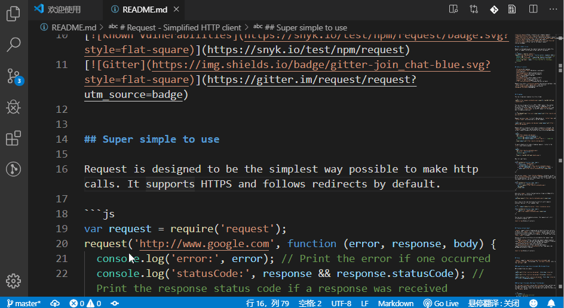
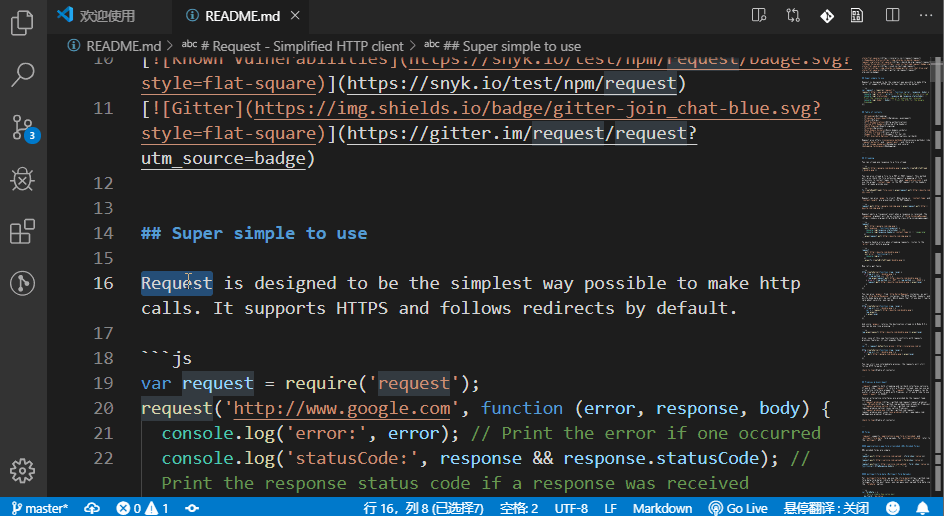
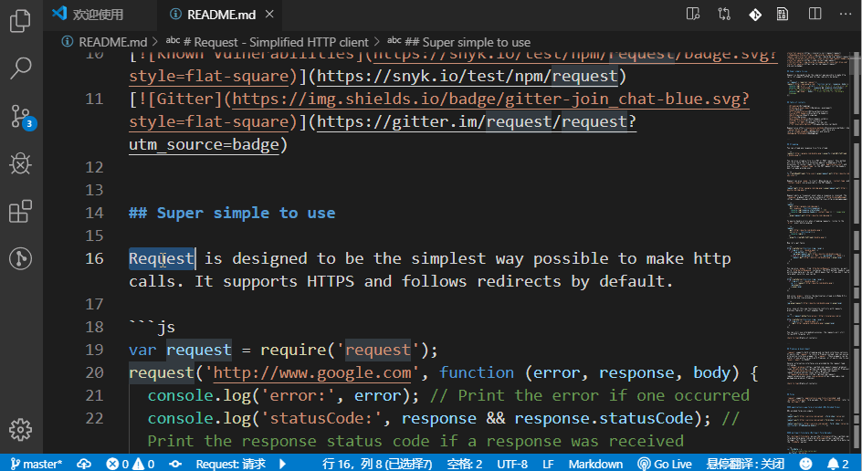
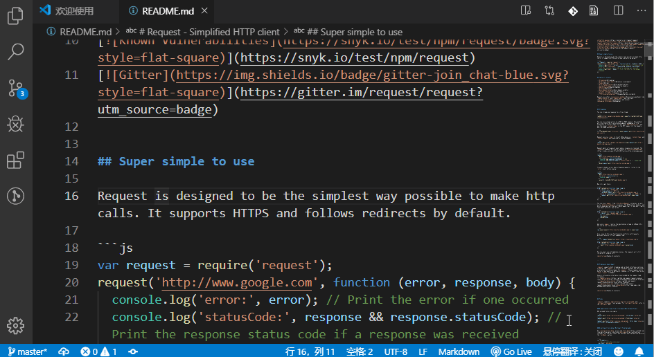
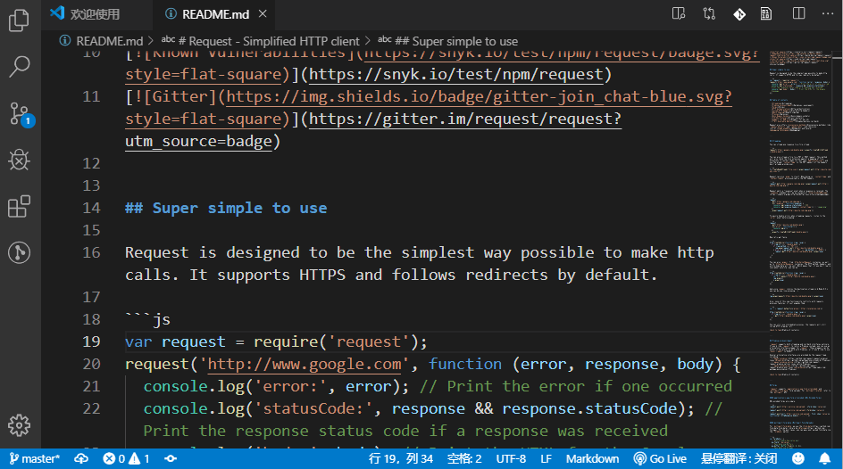
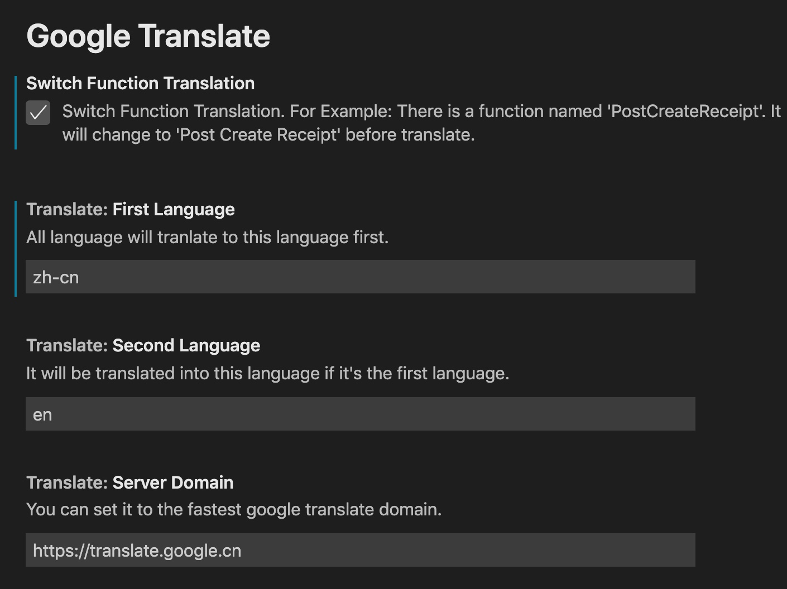

[English Readme](README.md) / 简体中文说明 / [繁體中文說明](README.zh-tw.md)

# Google Translate Extension

基于 [Google 翻译(cn)](https://translate.google.cn)，无需科学上网，无需 API Key 的翻译扩展。

❤ [Sponsor me](https://www.paypal.me/imlinhanchao) / [赞助开发者](http://sponsor.hancel.org/)

## Features

包含以下功能：

1. 自动语言互译 `Ctrl + Shift + Y` macOs: `Cmd + Shift + Y`；  
   
2. 翻译并复制结果到剪贴板 `Alt + T` macOs: `Option + T`；  
   
3. 展开候选词选择 `Shift + Alt + T` macOs: `Shift + Option + T`；  
      
4. 翻译并替换 `Ctrl + Shift + X` macOs: `Cmd + Shift + X`；  
   
5. 悬停翻译选中文字；  
   
6. 设置界面，可设置翻译的目标语言
   
7. 暂时切换到其他翻译语言，直到关闭工作空间或修改配置。 `google-translate.switch`
  
> Tips: 快捷键修改可以到 VSCode 的键盘快捷方式 ( `Ctrl + K Ctrl + S` ) 修改。

## Release Notes
### 1.0.0
1. 在插件 `Google Translate`的基础上 修改了替换功能, 增加替换候选项并修改了默认快捷键。
## For more information

* [GitHub](https://github.com/imlinhanchao/vsc-google-translate)
* [VSCode Market](https://marketplace.visualstudio.com/items?itemName=hancel.google-translate)
* Icon made by [Pixel perfect](https://www.flaticon.com/authors/pixel-perfect) from www.flaticon.com 
* Icons made by <a href="https://www.flaticon.com/authors/google" title="Google">Google</a> from <a href="https://www.flaticon.com/" title="Flaticon"> www.flaticon.com</a>

**Enjoy!**
