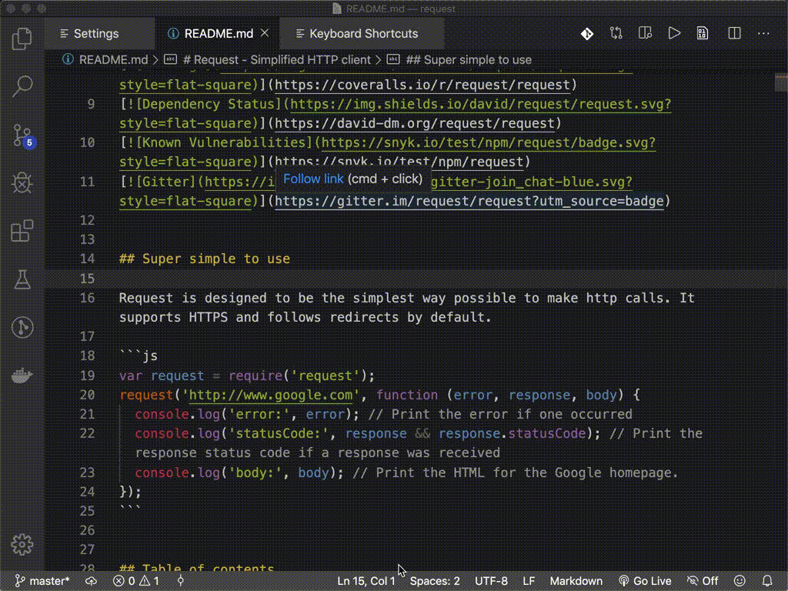
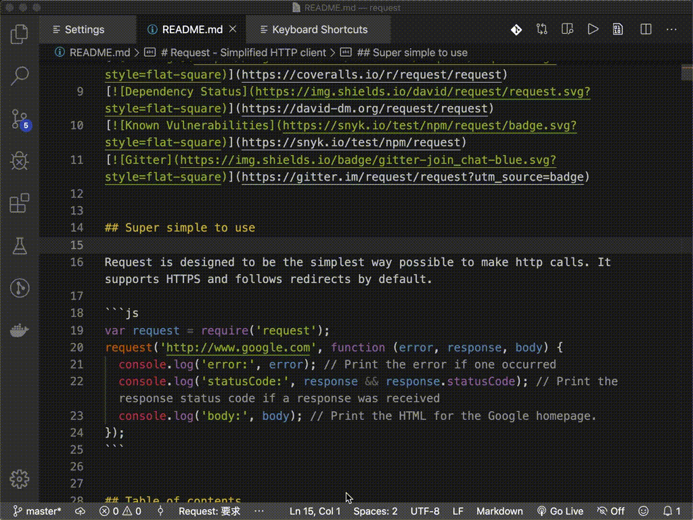
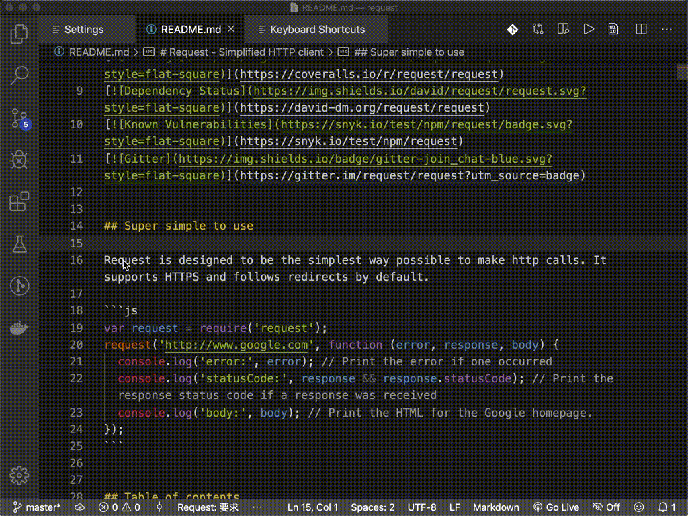
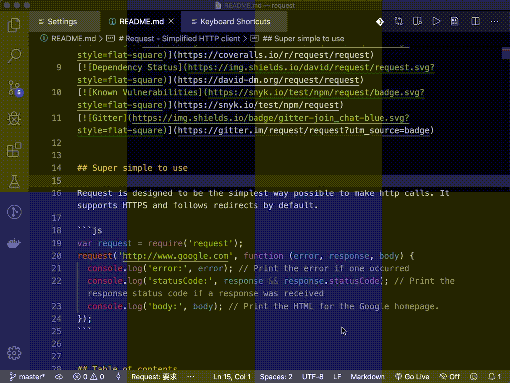

简体中文说明

# Translate Extension

翻译扩展。

## Features

包含以下功能：

1. 自动语言互译 `Ctrl + Shift + Y` macOs: `Cmd + Shift + Y`；  
   
2. 翻译并复制结果到剪贴板 `Alt + T` macOs: `Option + T`；  
   
3. 展开候选词选择 `Shift + Alt + T` macOs: `Shift + Option + T`；  
      
4. 翻译并替换 `Ctrl + Shift + X` macOs: `Cmd + Shift + X`；  
   
5. 悬停翻译选中文字；  
   
6. 设置界面，可设置翻译的目标语言
   
7. 暂时切换到其他翻译语言，直到关闭工作空间或修改配置。 `google-translate.switch`
  
> Tips: 快捷键修改可以到 VSCode 的键盘快捷方式 ( `Ctrl + K Ctrl + S` ) 修改。

## Release Notes
### 1.0.3
1. 增加翻译替换常量候选项。
### 1.0.2
1. 更改api为国内, 加快翻译速度。
### 1.0.1
1. 修复翻译并替换有时会报错。
### 1.0.0
1. 在插件 `Google Translate`的基础上 修改了替换功能, 增加替换候选项并修改了默认快捷键。
## For more information

**Enjoy!**
